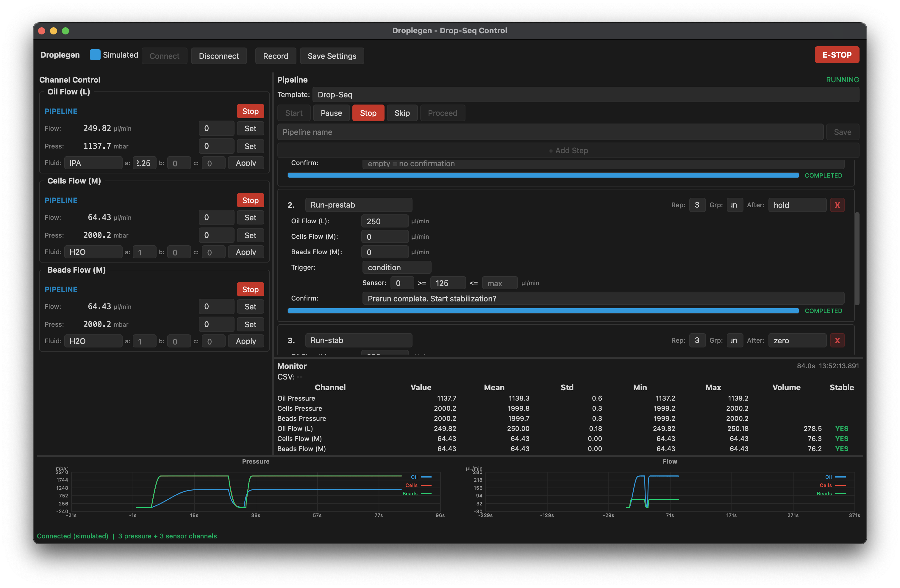

# Droplegen

Fluigent Drop-Seq microfluidics control application. PyQt6 GUI with real-time flow control, automated pipelines, and live monitoring for Fluigent hardware.



## Features

- **Real-Time Monitoring** — Live flow rate and pressure readings at 100ms intervals with stability detection and cumulative volume tracking
- **Automated Pipelines** — Multi-step pipelines with time, volume, threshold, and condition triggers. Group steps, repeat, and save as JSON
- **Hardware Control** — Passive flow regulation via Fluigent Flow EZ controllers and Flow Unit sensors (Oil/Cells/Beads channels)
- **Log Viewer** — Native Qt window for examining CSV logs with interactive pyqtgraph plots, checkbox filtering (logs/metrics/channels), time binning, axis limits, and crosshair with delta measurement
- **Simulated Mode** — Full development and testing without hardware using Fluigent SDK simulated instruments

## Prerequisites

- Python 3.12+
- [uv](https://docs.astral.sh/uv/) package manager
- Fluigent SDK (bundled in `fgt-SDK/`)

### macOS (Apple Silicon)

The Fluigent native library is x86_64 only. On Apple Silicon, use an x86_64 Python:

```bash
uv python install 3.12-x86_64
UV_PYTHON=3.12-x86_64 uv venv
```

## Quick Start

```bash
make setup   # install dependencies
make dev     # launch the GUI
```

## Development

```bash
make test    # run unit tests
make lint    # check code style (ruff)
make fmt     # auto-format code
```

## Architecture

3-thread model with a central Controller mediator:

- **Main Thread** — Qt UI (control panel, pipeline panel, monitor panel, pyqtgraph live plots)
- **Acquisition Thread** — 100ms sensor polling, optional CSV recording
- **Pipeline Thread** — Sequential step execution with trigger evaluation

See the [documentation](https://alexeystroganov.github.io/droplegen/) for details.

## Documentation

Built with VitePress in `docs/`. To run locally:

```bash
cd docs && bun install
make docs-dev    # start dev server
make docs-build  # build static site
```

Deployed automatically to GitHub Pages on push to `main`.

## License

Distributed under MIT licence, see `LICENSE` for more.
